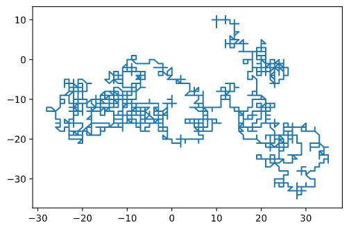

# Sensor Data Fusion - Full Stack

This project implements the three plus one main pillars of Sensor Data Fusion, respectively Bayesian inference.

## Main goal

That is:

- initiation
- prediction
- filtering
- retrodiction

as described in [Wolfgang Koch's book Tracking and Sensor Data Fusion](https://www.springer.com/gp/book/9783642392702).

If time allows, these models will also cover

- Interacting Multiple Models (incorporate maneuver classes into the dynamics model)
- Multiple Hypothesis Tracking (allow multiple 'realities' to converge in a survival-of-the-fittest manner)

To realize this, we need a set of features:

1. Generation of sensor data from one or many sensors with some added noise.
2. Visualization of the true and the SDF-stack generated approximations.
3. An UI to learn through play

## A rough development plan:

- [x] Generate sources and add adjustable noise
- [ ] Visualize them to get a feeling for what we are doing
- [ ] Model evolution model as Gauss-Markov transition density
- [ ] Implement one sensor which can potentially move (for Dopplereffect, which enables (G)MTI)
- [ ] Implement measurement equation as Gauss likelihood
- [ ] Visualize static situation (replicate Fig 2.1)
- [ ] Add multiple sensors and pull the signals together using eff. measurement error covariance
- [ ] Move sensors to allow TDoA and FDoA (FDoA needs two! => geometric fusion gain? p.42ff)
- [ ] Add explicit noise to generate false positives with 1-3 models
- [ ] Implement a Kalman Filter (if time allows an Extended Kalman Filter, because nature is not linear)
- [ ] Implement 'drop-outs' to motivate retrodiction
- [ ] Implement Retrodiction to compensate drop-outs
- [ ] Implement expectation gates to deal with false positives
- [ ] Add MHT tracking to see how the chain individual gating -> local combining -> pruning works
- [ ] Optional: IMM
- [ ] Optional: Sequential Likelihood Test
- [ ] Optional: Add map-data/tracks as artificial measurements

## Log

### Signal sources:

#### Very noisy static position in 2D:

orig: `[10, 10]`

#### Noisy dancer in 2D:

orig: `x(t) = sin(t)`